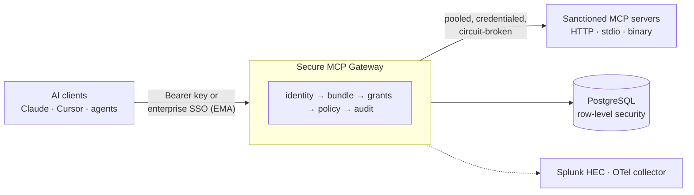

# Vyuu MCP Gateway

A multi-tenant security gateway for the Model Context Protocol. It sits
between AI clients (Claude Desktop, Cursor, ChatGPT, your own agents) and
the MCP servers an organisation sanctions, and makes every tool call
**authenticated, authorised, policy-checked, and audited** — with an
operator console for administrators, a portal for end users, and export
to Splunk and OpenTelemetry for the people who watch it.



Built by Vyuu as the server-side half of AI Shield; the Python package is
`vyuu_gateway`. Licensed under [Apache-2.0](LICENSE).

## What it does

- **Enforces** every `tools/call`: per-user API keys with lifetime
  policies or IdP-governed enterprise authorization (ID-JAG); public and
  private bundles with grants, just-in-time access and per-tool elevation;
  allow / deny / redact / rewrite policy; multi-round tool result
  governance; payload caps and secret redaction.
- **Curates** what agents can reach: register HTTP or stdio MCP servers
  (npx, uvx, verified binaries) with six outbound auth modes and mTLS,
  sync and diff their tool surfaces, publish curated **virtual servers**
  behind one URL each.
- **Scores risk**: an LLM classifies every server against the OWASP MCP
  Top 10 and MCP-in-System-of-Systems factors, shows what curation
  removed, and flags scores that no longer match the deployed tools.
- **Audits durably**: tool calls, rejections, admin actions and sign-ins
  in Postgres; the same stream to Splunk HEC (per tenant and per
  deployment) and traces/metrics over OpenTelemetry.
- **Integrates with the enterprise**: Entra ID and Google Workspace via
  SCIM, OIDC and SAML; Vault, AWS Secrets Manager or Kubernetes for
  secrets; Redis for scale-out; Kafka/NATS for an audit warehouse.

Full list: [`docs/FEATURES.md`](docs/FEATURES.md).

## Quick start (local, ~15 minutes)

Prerequisites: Python 3.12+, PostgreSQL 16 (14+ works), `xmlsec1` if you
will use SAML, and — only for stdio MCP servers — Node 18+ (`npx`) and
`uv` (`uvx`). Full matrix in [`docs/DEPLOYMENT.md`](docs/DEPLOYMENT.md#prerequisites).

```bash
git clone https://github.com/Presidentsu/vyuu-mcp-gateway.git
cd vyuu-mcp-gateway
python3 -m venv .venv && source .venv/bin/activate
pip install -e ".[dev]"

createuser -s vyuu && createdb -O vyuu vyuu_gateway      # local dev only
cp .env.example .env                                     # edit VYUU_DATABASE_URL + signing secrets
alembic upgrade head
python examples/lab_bootstrap.py                         # seed a tenant, an operator, demo MCP servers
python examples/drawio_lab_server.py                     # prints console/portal URLs + an operator token
```

Open the operator console at <http://127.0.0.1:8000/operator> and paste
the token the lab printed. The end-user portal is at
<http://127.0.0.1:8000/portal>. Step-by-step:
[`docs/onboarding/SETUP.md`](docs/onboarding/SETUP.md).

Production: [`docs/GETTING-STARTED.md`](docs/GETTING-STARTED.md)
(single VM · Kubernetes · hybrid with AWS secrets) and the manifests in
[`deploy/`](deploy/README.md).

## Documentation

| Read this | For |
|---|---|
| [`docs/ARCHITECTURE.md`](docs/ARCHITECTURE.md) | System context, the request path, data model, where configuration and secrets live, audit/SIEM/telemetry pipeline — with diagrams |
| [`docs/DEPLOYMENT.md`](docs/DEPLOYMENT.md) | Deployment topologies (Compose, Kubernetes, hybrid), ports, process model, every `VYUU_*` variable |
| [`docs/FEATURES.md`](docs/FEATURES.md) | Features and functionality by domain |
| [`docs/CUSTOMIZATION.md`](docs/CUSTOMIZATION.md) | Extension points: identity, policy, secrets, audit producers, SIEM vendors, console panels, branding |
| [`docs/onboarding/`](docs/onboarding/README.md) | Engineer onboarding: setup, backend/frontend maps, auth surfaces, testing, runbook, migrations, security model, API reference |
| [`docs/ADMIN-GUIDE.md`](docs/ADMIN-GUIDE.md) | Operator how-to |
| [`docs/architecture/vyuu-gateway-spec.md`](docs/architecture/vyuu-gateway-spec.md) | The original technical specification |
| [`BACKLOG.md`](BACKLOG.md) | Open work, roadmap and the decision log ("why did we do X this way") |
| [`docs/onboarding/CHANGELOG.md`](docs/onboarding/CHANGELOG.md) | What landed, when |
| [`HANDOFF.md`](HANDOFF.md) | Session-by-session engineering history and rationale |

## Repository layout

```
src/vyuu_gateway/   the gateway (FastAPI app, routers, services, audit, risk, SIEM, telemetry)
migrations/         Alembic revisions (schema history, RLS policies)
tests/              mirrors src/; run without a database or against PostgreSQL 16
examples/           lab server + bootstrap that exercise the real code path
deploy/             Docker Compose, Kubernetes and systemd manifests
docs/               everything above
```

## Verification

```bash
pytest                                                   # no database needed
VYUU_TEST_DATABASE_URL=postgresql+psycopg://vyuu@127.0.0.1:5432/vyuu_gateway_test pytest
ruff check .
mypy .
```

CI runs lint, the unit suite, and the PostgreSQL 16 integration suite on
every push and pull request.

## Contributing, security, license

See [`CONTRIBUTING.md`](CONTRIBUTING.md) for conventions and
[`SECURITY.md`](SECURITY.md) for how to report a vulnerability.
Apache License 2.0 — see [`LICENSE`](LICENSE).
