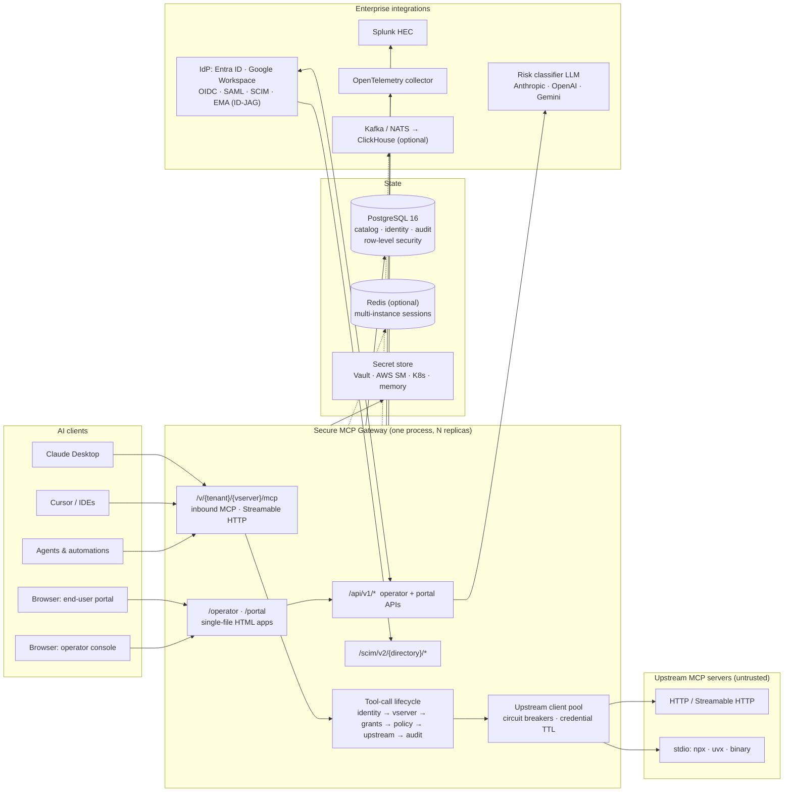
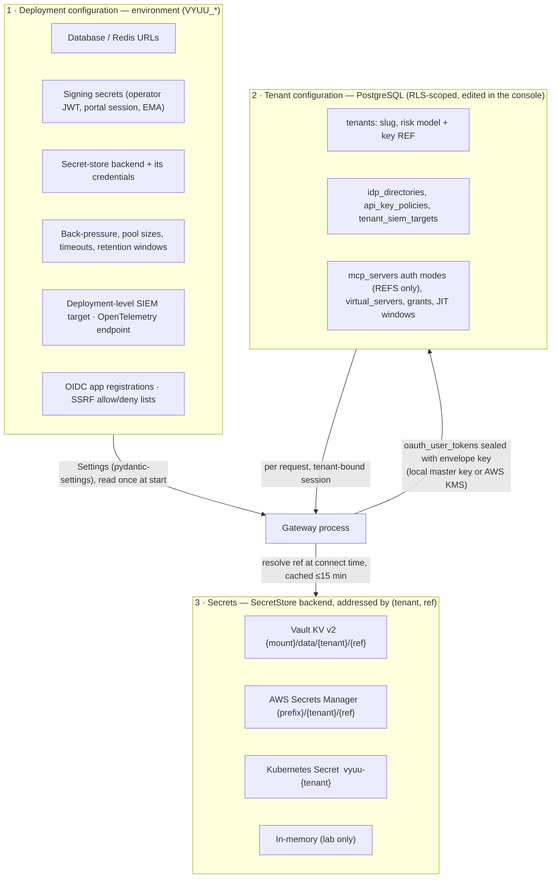
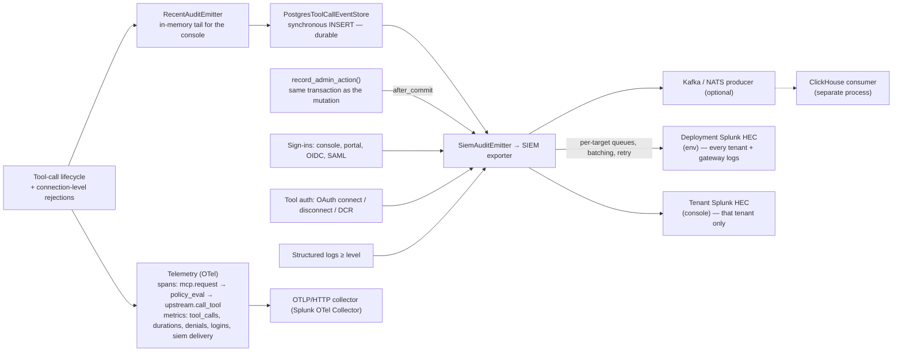

# Architecture

Secure MCP Gateway sits between AI clients and the MCP servers an
organisation sanctions. Every tool call is authenticated, authorised
against a curated bundle, policy-checked, forwarded through a pooled
upstream client, and audited — durably in Postgres and, optionally,
onward to a SIEM and an OpenTelemetry collector.

This page is the map. Detail lives in
[`onboarding/ARCHITECTURE.md`](onboarding/ARCHITECTURE.md) (the three
planes), [`onboarding/BACKEND_DEEP_DIVE.md`](onboarding/BACKEND_DEEP_DIVE.md)
(request lifecycles, schema column by column) and
[`onboarding/LOW_LEVEL_ARCH.md`](onboarding/LOW_LEVEL_ARCH.md)
(concurrency, transactions, failure modes).

## 1. System context



**One process serves everything.** The inbound MCP hot path, the
operator and portal JSON APIs, the SCIM server, and both web apps are
routers on one FastAPI application (`src/vyuu_gateway/main.py`). Scale
is horizontal: instances are stateless once sessions live in Redis.

## 2. The inbound tool call

```mermaid
sequenceDiagram
    autonumber
    participant AI as AI client
    participant GW as Gateway (inbound_mcp.py)
    participant ID as IdentityProvider
    participant DB as Postgres (RLS-bound session)
    participant POL as PolicyProvider
    participant UP as Upstream MCP
    participant AUD as Audit chain

    AI->>GW: POST /v/{tenant}/{vserver}/mcp  (Bearer vyuu_user_… or EMA token)
    GW->>ID: validate bearer → Principal
    GW->>DB: SET app.current_tenant_id; resolve vserver, visibility, grants, JIT
    alt not entitled
        GW->>AUD: access_attempt (deny) → SIEM
        GW-->>AI: 401 / 404
    end
    GW->>DB: resolve exposed tool → upstream server + tool (rename map)
    GW->>POL: evaluate(tool, args, policy)  [span: vyuu.policy_eval]
    alt deny
        GW->>AUD: tool_call (deny, rule) → Postgres → SIEM
        GW-->>AI: structured error envelope
    end
    GW->>UP: call_tool via pooled client  [span: vyuu.upstream.call_tool]
    UP-->>GW: CallToolResult (or input-required round → MRTR policy)
    GW->>GW: payload cap · secret redaction · structuredContent kept
    GW->>AUD: tool_call (allow, latency, upstream status, payloads if opted in)
    AUD->>DB: INSERT tool_call_events (synchronous, durable)
    AUD-->>AUD: SIEM exporter queue · Kafka/NATS · metrics
    GW-->>AI: JSON-RPC result
```

Two protocol eras are served by the same pipeline: the legacy
`initialize` session handshake and the stateless 2026-07-28 revision
(`Mcp-Method` header, per-request `_meta`). Enforcement does not depend
on the era.

## 3. Data model

Twenty-three tables, all in PostgreSQL. Every tenant-scoped table
carries `tenant_id` and a row-level-security policy keyed on the
`app.current_tenant_id` session setting; the audit, identity-provider
and secret-bearing tables use `FORCE ROW LEVEL SECURITY` so even the
table owner cannot bypass it.

```mermaid
erDiagram
    tenants ||--o{ operators : "admins"
    tenants ||--o{ users : "end users"
    tenants ||--o{ groups : ""
    users }o--o{ groups : "user_group_memberships"
    users ||--o{ user_api_keys : "bearer for AI clients"
    tenants ||--o{ api_key_policies : "key lifetime per user/group/tenant"
    tenants ||--o{ idp_directories : "Entra / Workspace"
    idp_directories ||--o{ users : "provisioned by SCIM / JIT"

    tenants ||--o{ mcp_servers : "catalog"
    mcp_servers ||--o{ mcp_capabilities : "tools · resources · prompts"
    mcp_servers ||--o| mcp_server_dcr_clients : "OAuth DCR / CIMD client"
    mcp_servers ||--o{ mcp_server_risk_assessments : "LLM classification"
    mcp_servers ||--o{ oauth_user_tokens : "per-user delegated tokens"
    users ||--o{ oauth_user_tokens : ""

    tenants ||--o{ virtual_servers : "published bundles"
    virtual_servers ||--o{ virtual_server_tools : "allow-list"
    mcp_servers ||--o{ virtual_server_tools : ""
    virtual_servers ||--o{ virtual_server_grants : "who may reach it"
    virtual_servers ||--o{ virtual_server_tool_grants : "JIT tool elevation"
    virtual_servers ||--o{ virtual_server_risk_assessments : "risk reduction"
    users ||--o{ access_requests : ""
    virtual_servers ||--o{ access_requests : ""

    tenants ||--o{ tool_call_events : "durable audit (FORCE RLS)"
    tenants ||--o{ admin_audit_log : "what admins did (FORCE RLS)"
    tenants ||--o{ tenant_siem_targets : "Splunk HEC target"
    tenants ||--o{ ema_consumed_jti : "ID-JAG replay guard"
```



| Group | Tables |
|---|---|
| Tenancy & identity | `tenants`, `operators`, `users`, `groups`, `user_group_memberships`, `user_api_keys`, `api_key_policies`, `idp_directories`, `ema_consumed_jti` |
| Catalog | `mcp_servers`, `mcp_capabilities`, `mcp_server_dcr_clients`, `oauth_user_tokens` |
| Publishing & access | `virtual_servers`, `virtual_server_tools`, `virtual_server_grants`, `virtual_server_tool_grants`, `access_requests` |
| Risk | `mcp_server_risk_assessments`, `virtual_server_risk_assessments` |
| Audit & export | `tool_call_events`, `admin_audit_log`, `tenant_siem_targets` |

Schema source of truth: `src/vyuu_gateway/db/models.py`; history in
`migrations/versions/` (31 Alembic revisions).

## 4. Where configuration and secrets live

There are exactly three places state comes from, and each has a reason.



- **Environment** (`src/vyuu_gateway/config.py`) is deployment-wide,
  read once, and is the only place a process-level credential lives.
  Changing it means redeploying, which is deliberate for things like
  the secret-store backend and the telemetry endpoint.
- **PostgreSQL** holds everything a tenant administrator edits in the
  console. Credential *values* never land here — `auth_headers`,
  `auth_env`, `risk_model_api_key_ref`, `hec_token_ref` are names
  resolved through the secret store. API responses redact even those
  columns' values.
- **The secret store** is pluggable behind one Protocol
  (`secrets/store.py`); the console can write into the in-memory lab
  store only, and tells you what to create in the real backend.

Database access itself: one SQLAlchemy engine per process
(`db/session.py`), pool sized to feed the per-tenant in-flight gate,
and every request-scoped session is pinned to a tenant with
`SET LOCAL app.current_tenant_id` on transaction begin.

## 5. Audit, SIEM export and telemetry



Design points worth knowing:

- Postgres is the source of truth for the console; the in-memory buffer
  is a read cache rehydrated at startup.
- SIEM export is non-blocking with bounded, counted loss: a target that
  cannot keep up drops the newest events, shows as degraded in the
  console with Splunk's own error text, and never affects the request.
- Tenant routing is an envelope invariant: a tenant's target receives
  only events carrying that tenant's id; gateway-wide log lines go only
  to the deployment target.
- Telemetry attributes are bounded (tenant, virtual server, upstream,
  decision, status) — never tool names or principal ids — so a busy
  tenant cannot mint unbounded time series.

## 6. Module map

```
src/vyuu_gateway/
  api/               FastAPI routers, one per surface; operator_ui.py + portal_ui.py are the web apps
  audit/             AuditEvent, emitter chain, Postgres store, Kafka/NATS producers, retention, ClickHouse consumer
  capabilities/      Upstream capability sync (tools/resources/prompts), drift detection, scheduler
  crypto/            Envelope encryption (local key / AWS KMS) for tokens at rest
  db/                SQLAlchemy models, session + RLS binding
  graph/             NHI relationship graph (who calls what)
  identity/          Inbound identity providers: API keys, EMA / ID-JAG, CIMD
  idp/               Enterprise IdP directories: SCIM server side, Workspace polling, SAML
  mcp/               MCP protocol helpers: SDK v1/v2 compat, MRTR policy, transports
  operator_auth/     Operator JWT + password auth
  policy/            Policy providers (simple / management plane)
  registry/          Services: servers, virtual servers, users, groups, access requests, API-key policy
  risk/              LLM risk classification: taxonomy (OWASP MCP Top 10, MCP-in-SoS), providers, reduction
  scim/              SCIM 2.0 server
  secrets/           SecretStore Protocol + Vault / AWS / Kubernetes / memory backends
  sessions/          Session registry (in-memory / Redis)
  siem/              Splunk HEC export: events, exporter, targets, bridges
  telemetry/         OpenTelemetry traces + metrics (optional extra)
  tool_calls/        The lifecycle: identity → resolve → policy → upstream → audit
  upstream/          Outbound clients, pool, circuit breakers, OAuth (client-credentials, auth-code, JWT-bearer, DCR/CIMD), mTLS, SSRF guard
  users/             Portal users: local auth, sessions, OIDC providers, API keys
  virtual_servers/   Resolver + tool elevation
```
