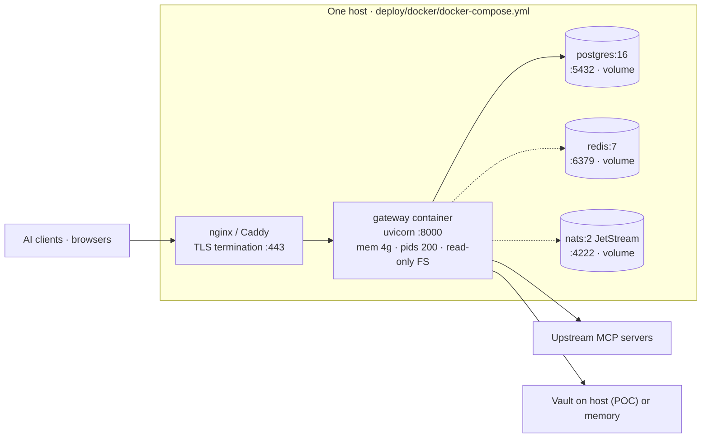
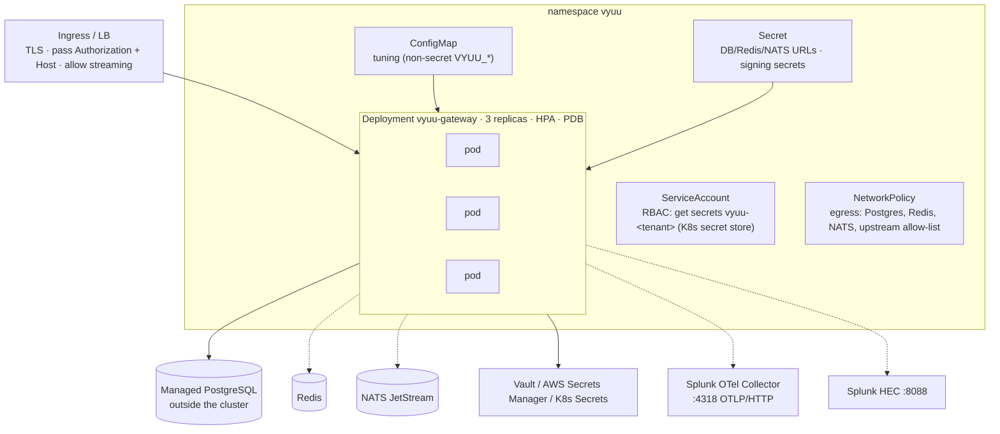

# Deployment

How the gateway is run, what it connects to, and every knob it reads.
Manifests for all three shapes ship in [`deploy/`](../deploy/README.md);
the step-by-step production guide is
[`GETTING-STARTED.md`](GETTING-STARTED.md); day-2 operations are in
[`DEVOPS-HANDOFF.md`](DEVOPS-HANDOFF.md).

## Prerequisites

| Component | Version | Required? | Why |
|---|---|---|---|
| Python | 3.12 – 3.14 | yes | Runtime |
| PostgreSQL | 16 recommended (14+ works) | yes | Catalog, identity, durable audit; row-level security |
| `xmlsec1` | system package | yes if SAML sign-in is used (import-time for `pysaml2`) | SAML signature operations |
| Node.js + `npx` | 18+ | for `npm` stdio upstreams | Launches `npx -y <package>` MCP servers |
| `uv` (`uvx`) | latest | for `pypi` stdio upstreams | Launches `uvx <package>` MCP servers |
| Redis | 6+ | multi-instance only | Shared session registry across replicas |
| Vault / AWS Secrets Manager / Kubernetes Secrets | — | production | Secret store backend (the in-memory store is lab-only) |
| Kafka or NATS JetStream | — | optional | Durable audit fan-out to a warehouse (ClickHouse consumer included) |
| Splunk HEC endpoint | — | optional | SIEM export |
| OpenTelemetry collector | — | optional (`pip install ".[otel]"`) | Traces + metrics |
| Docker / Kubernetes | 24+ / 1.27+ | per shape | Container deployment |
| TLS terminator (nginx, Caddy, Traefik, ingress) | — | production | The gateway speaks plain HTTP on one port |

Outbound network access the gateway needs: each upstream MCP server,
the IdP issuers you connect (Entra ID, Google), the secret-store
backend, the SIEM/collector endpoints, and — for the risk classifier —
the chosen LLM vendor's API.

## Shape 1 · Single-box appliance (Docker Compose)

Starter, Standard and Production tiers differ only in the
`VYUU_INBOUND_*` and `VYUU_DB_POOL_*` values and the number of gateway
replicas (see the compose file header).

## Shape 2 · Kubernetes

Probes target `/healthz` (mounted at the app root and bypassed by the
per-tenant in-flight gate) so a load burst never false-pages
liveness. Manifests: `deploy/kubernetes/{deployment,configmap,secret.yaml.example}`.

## Shape 3 · Hybrid (gateway on-prem, secrets in AWS)

Same as Shape 1 or 2 with `VYUU_SECRET_STORE_BACKEND=aws_secrets_manager`
and IAM Roles Anywhere for the on-prem identity; secrets live under
`{prefix}/{tenant_id}/{ref}`. See
[`operations/secret-store-setup.md`](operations/secret-store-setup.md).

## Ports and routes

| Port / path | What | Auth |
|---|---|---|
| `:8000` | the only listening port (behind TLS in production) | — |
| `/v/{tenant_id}/{vserver}/mcp` | inbound MCP, Streamable HTTP (legacy `initialize` sessions and stateless 2026-07-28 requests) | API key bearer or EMA token |
| `/operator`, `/portal` | web apps | bearer / session in JS |
| `/api/v1/*` | operator + portal JSON APIs | operator JWT / portal session |
| `/api/v1/auth/*`, `/api/v1/operator-auth/*` | sign-in flows (password, OIDC, SAML) | public start |
| `/scim/v2/{directory_id}/*` | SCIM 2.0 server | per-directory bearer |
| `/oauth/token`, `/.well-known/*` | EMA resource-authorization-server endpoints (when enabled) | per spec |
| `/healthz` | liveness (no auth, no gate) | none |
| `/docs`, `/openapi.json` | API docs | none — gate in production |

Reverse proxies must pass `Authorization` and `Host` and must not buffer
`/v/.../mcp` responses (streaming).

## Process model

One uvicorn worker per container by default; scale by replicas. Inside
a process: FastAPI on an event loop; synchronous database work runs in
the thread pool; a per-tenant in-flight semaphore fast-fails with 503
when a tenant saturates the worker; upstream calls go through a pooled
client per `(tenant, server)` with a circuit breaker and a 15-minute
credential TTL so rotated secrets take effect without a restart.
Background tasks in the same process: capability-sync scheduler,
SCIM hard-delete sweeper, audit retention prune, Workspace directory
polling, SIEM export workers.

## Configuration reference

All configuration is environment-driven (`pydantic-settings`, prefix
`VYUU_`, `.env` honoured). Canonical source: `src/vyuu_gateway/config.py`.

### Core

| Variable | Default | Purpose |
|---|---|---|
| `VYUU_DATABASE_URL` | local dev URL | PostgreSQL, `postgresql+psycopg://…` |
| `VYUU_ENVIRONMENT` / `VYUU_LOG_LEVEL` | `local` / `INFO` | Environment tag · JSON log level |
| `VYUU_GATEWAY_INSTANCE_ID` | `gateway-local` | Stamped on every audit event and telemetry resource |
| `VYUU_PUBLIC_BASE_URL` | `http://127.0.0.1:8000` | Outside origin behind the proxy (EMA issuer, callbacks) |
| `VYUU_DEFAULT_TENANT_ID` | unset | Single-tenant mode: login pages resolve this tenant |
| `VYUU_PORTAL_BASE_DOMAIN` | unset | `acme.gateway.example.com` tenant routing |
| `VYUU_OPERATOR_AUTH_SIGNING_SECRET` / `VYUU_PORTAL_SESSION_SIGNING_SECRET` | dev placeholders | HMAC secrets — set long random values |
| `VYUU_PORTAL_SESSION_TTL_SECONDS` / `VYUU_SESSION_TTL_SECONDS` | 43200 / 3600 | Portal session · inbound MCP session lifetimes |
| `VYUU_INBOUND_IDENTITY_PROVIDER` | `fake` | `api_key` in production |
| `VYUU_REDIS_URL` | unset | Required outside local/test for multi-instance sessions |

### Secrets and encryption

| Variable | Purpose |
|---|---|
| `VYUU_SECRET_STORE_BACKEND` | `memory` · `vault` · `aws_secrets_manager` · `kubernetes` |
| `VYUU_VAULT_ADDR`, `_TOKEN`, `_MOUNT`, `_NAMESPACE`, `_VALUE_FIELD`, `_TIMEOUT_SECONDS` | Vault KV v2 |
| `VYUU_AWS_REGION`, `VYUU_AWS_SECRETS_PREFIX`, `VYUU_AWS_SECRETS_VALUE_FIELD` | AWS Secrets Manager (boto3 credential chain) |
| `VYUU_K8S_NAMESPACE`, `_API_SERVER`, `_SECRET_NAME_PREFIX`, `_TIMEOUT_SECONDS` | Kubernetes Secrets, one per tenant |
| `VYUU_ENVELOPE_ENCRYPTION_BACKEND` (`none` · `local` · `aws_kms`), `VYUU_ENVELOPE_MASTER_KEY`, `VYUU_ENVELOPE_KMS_KEY_ID` | Encryption of OAuth tokens at rest |

### Inbound protection and sizing

| Variable | Default | Purpose |
|---|---|---|
| `VYUU_INBOUND_LIMIT_CONCURRENCY`, `_LIMIT_MAX_REQUESTS`, `_BACKLOG`, `_KEEP_ALIVE_SECONDS` | 200 / 10000 / 128 / 5 | uvicorn back-pressure |
| `VYUU_INBOUND_PER_TENANT_INFLIGHT_LIMIT` | 64 | Per-tenant in-flight gate (503 when exceeded) |
| `VYUU_INBOUND_MAX_REQUEST_BODY_BYTES` / `_MAX_RESPONSE_BODY_BYTES` | 5 MiB / 25 MiB | Transit payload caps |
| `VYUU_INBOUND_REDACT_RESPONSE_SECRETS` | `false` | Scrub secret-shaped strings from responses |
| `VYUU_DB_POOL_SIZE`, `_MAX_OVERFLOW`, `_TIMEOUT_SECONDS`, `_RECYCLE_SECONDS` | 20 / 40 / 10 / 1800 | SQLAlchemy pool |
| `VYUU_UPSTREAM_READ_TIMEOUT_SECONDS`, `_MAX_CONNECTIONS_PER_SERVER`, `_HEALTH_TIMEOUT_SECONDS`, `_CIRCUIT_BREAKER_FAILURE_THRESHOLD`, `_CIRCUIT_BREAKER_RECOVERY_TIMEOUT_SECONDS`, `_CLIENT_MAX_AGE_SECONDS` | 30 / 4 / 5 / 5 / 30 / 900 | Upstream pool + breakers + credential TTL |
| `VYUU_UPSTREAM_SSRF_GUARD_ENABLED`, `VYUU_HTTP_URL_ALLOWLIST`, `_DENYLIST`, `_ALLOW_PRIVATE_NETWORKS` | on / [] / [] / false | Registration and connect-time URL safety |
| `VYUU_BINARY_COSIGN_VERIFICATION_KEY_PATH`, `_CERTIFICATE_IDENTITY`, `_CERTIFICATE_OIDC_ISSUER` | unset | Sigstore verification of binary upstreams |
| `VYUU_MRTR_ALLOWED_INPUT_KINDS`, `VYUU_MRTR_ALLOWED_ELICIT_URL_HOSTS` | [] (deny all) | Multi-round tool result governance |

### Audit, retention, export

| Variable | Default | Purpose |
|---|---|---|
| `VYUU_AUDIT_CAPTURE_RAW_DEFAULT` | `false` | Capture raw args/responses (privacy default off) |
| `VYUU_AUDIT_RAW_CAPTURE_BYTE_CAP` | 10 MiB | Storage cap for captured payloads |
| `VYUU_TOOL_CALL_EVENT_RETENTION_DAYS`, `VYUU_ADMIN_AUDIT_RETENTION_DAYS` | 0 (keep forever) | Retention prune windows |
| `VYUU_AUDIT_RETENTION_INTERVAL_SECONDS`, `_BATCH_SIZE`, `_MAX_ROWS_PER_CYCLE` | 86400 / 5000 / 200000 | Prune cadence and chunking |
| `VYUU_SIEM_HEC_URL`, `_TOKEN`, `_INDEX`, `_SOURCE`, `_HOST`, `_VERIFY_TLS` | unset | Deployment-level Splunk HEC target |
| `VYUU_SIEM_CATEGORIES`, `_INCLUDE_RAW_PAYLOADS`, `_LOG_LEVEL`, `_BATCH_MAX_EVENTS`, `_FLUSH_INTERVAL_SECONDS`, `_MAX_QUEUE_SIZE`, `_TARGET_CACHE_TTL_SECONDS` | see config | What ships and how |
| `VYUU_OTEL_ENABLED`, `_EXPORTER_OTLP_ENDPOINT`, `_EXPORTER_OTLP_HEADERS`, `_SERVICE_NAME`, `_TRACES_ENABLED`, `_METRICS_ENABLED`, `_TRACES_SAMPLE_RATIO`, `_METRIC_EXPORT_INTERVAL_SECONDS` | off / `http://localhost:4318` | OpenTelemetry |

### Identity providers and enterprise authorization

| Variable | Purpose |
|---|---|
| `VYUU_OIDC_MICROSOFT_TENANT_ID`, `_CLIENT_ID`, `_CLIENT_SECRET`, `_REDIRECT_URI` | Entra ID OIDC app |
| `VYUU_OIDC_GOOGLE_CLIENT_ID`, `_CLIENT_SECRET`, `_REDIRECT_URI`, `_HOSTED_DOMAIN` | Google Workspace OIDC app |
| `VYUU_WORKSPACE_POLL_INTERVAL_SECONDS` | Workspace directory polling cadence (default 300) |
| `VYUU_EMA_ENABLED`, `VYUU_EMA_SIGNING_SECRET`, `VYUU_EMA_ACCESS_TOKEN_TTL_SECONDS`, `VYUU_EMA_CIMD_RESOLUTION_ENABLED`, `VYUU_EMA_CIMD_CACHE_TTL_SECONDS` | MCP Enterprise-Managed Authorization (ID-JAG) |

### Background work

| Variable | Default | Purpose |
|---|---|---|
| `VYUU_CAPABILITY_SYNC_ENABLED`, `_INTERVAL_SECONDS`, `_MAX_CONCURRENT_PER_TENANT`, `_PER_CALL_TIMEOUT_SECONDS` | off / 3600 / 4 / 30 | Periodic upstream drift detection |
| `VYUU_AUTO_SYNC_CAPABILITIES_ON_REGISTRATION`, `VYUU_AUTO_SYNC_PER_CALL_TIMEOUT_SECONDS` | on / 30 | Sync right after a server is registered |
| `VYUU_POLICY_PROVIDER_BACKEND`, `VYUU_MANAGEMENT_PLANE_POLICY_BASE_URL`, `_TTL_SECONDS`, `_BEARER_TOKEN` | `simple` | Policy source |

## Database role

Production connects as a **non-superuser** role that owns the schema but
does not bypass row-level security. Migrations run with the same role
(`alembic upgrade head` reads `VYUU_DATABASE_URL`). A superuser
connection bypasses RLS unconditionally — fine for a lab, wrong for
production.

## Upgrades

1. Pull the new image or tag.
2. `alembic upgrade head` (migrations are additive and idempotent where
   they seed data; each carries a docstring explaining why).
3. Roll the deployment. Instances are stateless with Redis sessions;
   without Redis, in-flight legacy MCP sessions on the old instance end
   and clients re-`initialize`.
